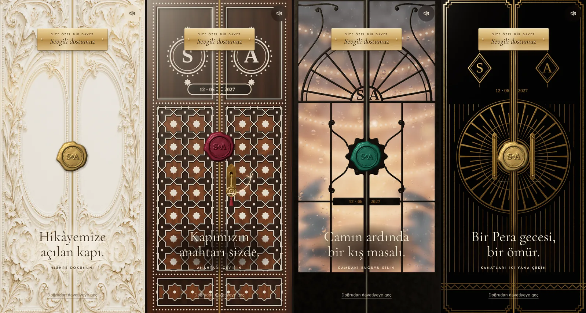
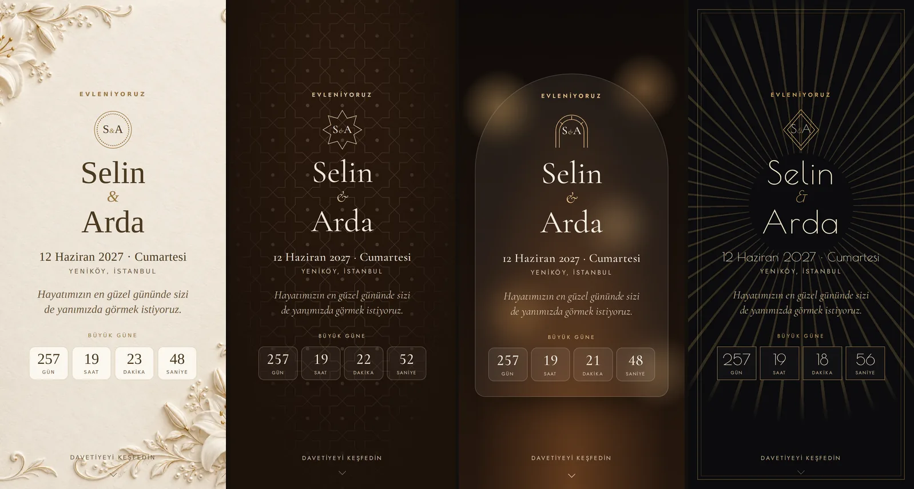
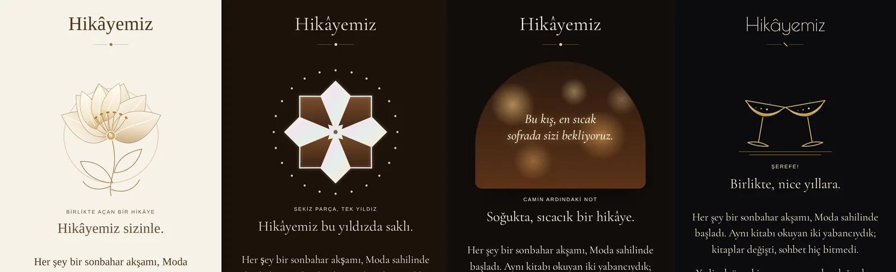

# Mühürlü Kapılar 2.0 — Fildişi Rölyef ve üç yeni kapı

Bu klasör, EVET projesinden dışa aktarılan **Fildişi Rölyef** açılış deneyiminin
güçlendirilmiş hâlini ve aynı kalitede **üç alternatif kapıyı** içerir. Özgün paket
ilk commit'te olduğu gibi duruyor; sonraki commit'ler her değişikliği ayrı ayrı gösterir.

| Kapı | Malzeme | Açılış ritüeli | Kapının ardındaki dokunuş | Ses |
| --- | --- | --- | --- | --- |
| **Fildişi Rölyef** (`rolyef`) | Fildişi lake, kabartma zambak, şampanya altın | Mühre dokunma | Açan zambak, savrulan polen | Arp |
| **Sedef Kakma** (`kakma`) · yeni | Ceviz kündekâri, Selçuklu yıldızı, yanardöner sedef | Pirinç anahtarı çevirme | Sedef yıldızı birleştirme | Hicaz makamında ud |
| **Kış Bahçesi** (`kisbahcesi`) · yeni | Dövme demir, buğulu cam, içeride ışık dizileri | Camdaki buğuyu parmakla silme | Buğulu camın ardındaki not | Çelesta, rüzgâr çanı |
| **Pera Deco** (`pera`) · yeni | Piyano siyahı lake, fırçalanmış pirinç güneş | Sürgülü kanatları iki yana çekme | Tokuşan şampanya kadehleri | Mantar, köpük, caz akoru |



## Hemen deneyin

```bash
npm install
npm run dev          # http://localhost:5173 — telefondan ağ adresiyle açın
npm run build        # dist/ klasörüne durağan site
npm run typecheck
```

Önizleme uygulamasında koleksiyon sayfası, kapı → davetiye deneyimi ve bir **atölye**
vardır (sol üstteki kaydırıcı simgesi): isimler, kapıdaki tarih, dil, balmumu rengi,
amblem, mühür biçimi, açılış biçimi (sinematik/sakin), ışık (özgün/sıcak/serin) ve ses
canlı değiştirilebilir. Ayarlar adres çubuğunda tutulur; bağlantıyı paylaşan aynı kapıyı
görür: `/?tema=kakma&ad1=Elif&ad2=Mert&dil=en&acilis=gentle`.

## Neler değişti

### Motor (bütün kapılar)

- **Doğru kabartma ışığı.** Özgün sahne `rolyef-relief-mask.png` dosyasını `bumpMap`
  olarak veriyordu; Three.js bu haritanın kırmızı kanalını okur ve bu PNG'de kırmızı kanal
  neredeyse ikili (beyaz ya da tek bir gri). Asıl kabartma bilgisi **alfa kanalında**.
  Artık alfa (yoksa parlaklık) okunup yumuşatılıyor ve normal haritasına çevriliyor;
  oymalar ışığı gerçekten alıyor.
- **Işık dalgası.** Mühür kırılınca bir ışık halkası mühürden dışa yayılır ve oymaların
  sırtını altınla yaldızlar (paketteki `rolyef-light-study` çalışmasının gerçek zamanlı
  hâli). Eski iki sabit ışık çizgisinin yerini aldı; `trails: true` eski ad olarak çalışır.
  Ay Işığı ve Gül Altını da kendi maskeleriyle bu dalgayı kullanır (`wave: true`).
- **Beklerken parıltı.** Kapı dururken birkaç saniyede bir kabartmalardan ince bir ışık
  geçer; saniyede 30 kare çizilir, ~40 saniye sonra kendiliğinden durur (pil dostu).
- **Işık parmağı ve telefonu izler.** Parmak kapıda gezindikçe ya da telefon eğildikçe
  (Android'de izin istemeden) ışık kabartmalarda kayar.
- **Sinematik açılış.** Kamera eşikten içeri süzülür, aralıktan önce ince bir huzme sonra
  sıcak bir ışık taşar, huzmede temaya özgü parçacıklar uçuşur (altın toz, sedef ışıltısı,
  kar, şampanya kabarcığı).
- **Görünüm ayarları artık kapıya da uygulanıyor.** `appearance.opening` (`cinematic` /
  `gentle`) ve `appearance.palette` (`original` / `warm` / `cool`) özgün kodda tanımlıydı
  ama kapı onları kullanmıyordu.
- **Sürgülü kanatlar** (`motion: 'slide'`), **cam delikli kanatlar** (alfa haritası),
  **koyu cilalar için stüdyo ortamı** (lake yüzeyde gri tül yerine gerçek yansıma).
- **Performans:** yavaş cihazda çözünürlük kademeli düşer; çizimli kapının yüzeyi 3B motor
  indirilirken paralel hazırlanır; ağır döngüler eşzamanlı işlevlerde (V8 ilk seferde de hızlı
  derler); renk dışı haritalar doğrudan `DataTexture`.
- **Dayanıklılık:** 9 sn yükleme sınırı (aşılırsa CSS kapı), mühür yazısı beklemesi en fazla
  1.8 sn, yükleme 2.5 sn'yi geçerse mühre dokunmak CSS kapıyla açar, kurulum hatası konsola
  yazılır (`[mühürlü kapı] ...`).
- **Modüler yapı:** `source/lib/door-engine/` altında yüzey, malzeme, efekt, takılan parça ve
  cam modülleri; `three-door-scene.ts` bunları birleştirir.

### Ritüeller ve arayüz

- Üç yeni ritüel: **anahtar** (halkayı tutup çeyrek tur çevirin), **buğu** (camı silin),
  **sürgü** (kanatları iki yana çekin; iki parmakla açmak da olur). Hepsi tek dokunuşla ve
  klavyeyle (Enter/Boşluk) de tamamlanır; hiçbir konuk bir harekette takılmaz.
- Konuğa **ses anahtarı** (sağ üst); tercih tarayıcıda saklanır. Çift sesi kapattıysa görünmez.
- **Üç dil:** kapı metinleri `source/lib/door-copy.ts` içinde Türkçe, İngilizce, Almanca.
- Temaya özgü sentez sesler (dosya indirilmez): arp, Hicaz ud, çelesta, mantar + caz akoru;
  anahtar tıkları, kilit dili, camda gıcırdayan parmak.

### Özgün pakette bulunan ve düzeltilen hatalar

1. **Yedek (WebGL'siz) kapı hiç açılmıyordu.** Mühre dokununca durum `opening` oluyor, yedek
   kanatlar ve 2B mühür DOM'dan kalkıyordu; kapı açılmak yerine bir anda kayboluyordu. Ayrıca
   yedekte kapı görseli dünya katmanının arka planında da duruyordu: kanatlar açılsa bile ardında
   aynı kapı görünürdü. İkisi de düzeltildi; kanatlar artık dönerek (sürgülüde kayarak) açılır.
2. **Yükleme sınırı yoktu.** Yazı ya da 3B paket gelmezse konuk "Davetiniz hazırlanıyor…"
   yazısında kalıyordu (mühür düğmesi yükleme boyunca kapalıydı).
3. **2B ve 3B mühür farklı tohumla çiziliyordu.** Yüklenirken görünen mühürle 3B mühürün kenarı
   farklıydı; kapı hazır olunca mühür biçim değiştiriyordu.
4. **Çatlak ışığı gri kare bırakabiliyordu.** 2B mühürde opak siyah kanvas karışım kipiyle
   gizleniyordu; artık gerçek saydamlıkla, altın tonla çizilir.

## Kapının ardı: içerik



- **Hikâye dokunuşları** (`source/app/davet/[token]/`): `IvoryBloom` güçlendirildi (iç taç
  yapraklar, uzayan başçıklar, savrulan polen; aynı API), üç yeni dokunuş eklendi:
  `PearlStar`, `FrostNote`, `ChampagneToast`. `StoryTouch` temaya göre doğru olanı seçer.
  Hepsi `active / paused / expanded / onToggle` sözleşmesini paylaşır, isteğe bağlı `sounds`
  ve `lang` alır, `aria-expanded` ile hikâye metnini (`#invitation-story-text`) açar.
- **Örnek davetiye** (`example/davetiye/`): kahraman bölüm ve canlı geri sayım, hikâye ve
  anılar, tören kartları (yol tarifi, **takvime ekle** `.ics`), gecenin akışı, menü, IBAN
  kopyalama, **LCV formu**, fotoğraf etiketi. Metinler üç dilde, bölümler
  `appearance.sections` bayraklarına uyar. Her tema kapının malzemesini sayfada sürdürür.
  Bu sayfa bir **referanstır**; uygulamanızın kendi davetiye sayfası varsa oradan parça
  parça alabilirsiniz.



## Projeye ekleme

Bağımlılıklar değişmedi: `gsap 3.15.0`, `react 19.2.6`, `react-dom 19.2.6`, `three 0.186.1`.
Kod `@/` takma adının kaynak kökünü göstermesini bekler (özgün paketle aynı).

1. `source/` altındakileri aynı dizin yapısıyla kopyalayın. Yeni dosyalar:
   - `source/lib/door-engine/**` (motor modülleri ve çizimli kapılar)
   - `source/lib/door-copy.ts` (kapı metinleri, tr/en/de)
   - `source/app/davet/[token]/door-rituals.tsx`, `story-touch.tsx`, `story-touch-copy.ts`,
     `pearl-experience.tsx`, `frost-experience.tsx`, `deco-experience.tsx`
   - `source/app/door-experiences.css`
2. Stilleri global girişe ekleyin:
   ```ts
   import './app/three-door.css';
   import './app/sealed-doors.css';
   import './app/ivory-experience.css';
   import './app/door-experiences.css';
   ```
3. `public/` görsellerini kökte tutun: `rolyef-*.webp/png` (özgün) ve yeni kapakların
   `kakma-door.webp`, `kisbahcesi-door.webp`, `pera-door.webp`. Kapaklar yalnızca yükleme
   anında ve WebGL olmayan cihazlarda görünür; 3B kapı tarayıcıda çizilir.
4. Yazılar: mühür ve kapılar **Cormorant Garamond** bekler (yoksa Georgia ile çizer).
   Pera'nın harfleri **Poiret One** ile daha güzel durur; yüklü değilse serif kullanılır.
5. Tema kimlikleri: `THEME_IDS` üç yeni kimlik içerir (`kakma`, `kisbahcesi`, `pera`);
   veritabanında ya da istek doğrulamasında tema listesi tutuyorsanız onları da ekleyin.

### API uyumu

- `SealedDoor` özellikleri aynı. Yeni ve isteğe bağlı: `date` (çizimli kapıya işlenen kısa
  tarih), `lang` (arayüz dili; verilmezse `appearance.languages[0]`), `onEngine` (atölye
  önizlemesi için sahneye erişim). `sealedDoorCopy` dışa aktarımı Türkçe metin olarak durur.
- `DoorConfig` yeni alanların hepsi isteğe bağlı: `procedural`, `captions`, `wave`, `motion`,
  `finish`, `atmosphere`, `soundscape`, `handles`; `mask` artık isteğe bağlı (çizimli
  kapılarda yok). `DoorRitual` üç yeni değer aldı: `key`, `wipe`, `slide`.
- `createDoorScene` ek seçenekler alır: `personal`, `mode`, `palette`, `tilt`, `surface`.
  Dönen nesne `turnKey`, `strain`, `wipeAt`, `wipeEnd`, `autoWipe`, `setSealVisible`, `seek`
  yöntemleriyle genişledi; eski yöntemler aynı davranır.
- `onComplete` "Doğrudan davetiyeye geç" ile iki kez çağrılabilir (özgün davranış); işleyici
  tekrar çağrıya dayanıklı olmalı (ör. `setOpened(true)`).
- Hareketi azaltmayı seçen konukta kapı, özgün sözleşmede olduğu gibi CSS ile gizlenir;
  davetiyeyi doğrudan gösterin (bkz. `example/FildisiRolyefOpening.tsx`).

### Diğer kapılarınız

Motor, `DoorConfig` kaydı olan bütün kapılarla (Al Kadife, Zümrüt Köşk, Ay Işığı, Gül
Altını, Konak, İpek Bağ…) çalışmaya devam eder. Kabartma maskesi alfa taşıyorsa alfadan,
taşımıyorsa parlaklıktan okunur. Bu kapıların görselleri pakette olmadığı için burada
denenemedi; kendi projenizde bir kez gözden geçirmenizi öneririm (özellikle Ay Işığı ve Gül
Altını'nda artık ışık dalgası açık).

## Nasıl çalışır

```
SealedDoor ─┬─ (paralel) wax-seal yazısı ─→ door-engine/surface ─→ yüzey (harita katmanları)
            └─ (paralel) three-door-scene ─→ createDoorScene(surface) ─→ WebGL sahne
                                              ├─ materials  (kabartma ışığı, sedef, lake, demir)
                                              ├─ fixtures   (tokmak, kurdele, anahtar, kulplar)
                                              ├─ glass      (buğu gölgelendiricisi, silme maskesi)
                                              └─ effects    (parçacıklar, iç ışık, stüdyo)
```

- **Görsel kapı** (Fildişi): resim + kabartma maskesi → normal, kıvrım ve ışık dalgası haritaları.
- **Çizimli kapı** (`painters/*.ts`): Canvas ile keskin maskeler çizilir (çıtalar, yıldızlar,
  harfler, pirinç çizgiler, demir kayıtlar), piksel piksel malzeme verilir (ceviz damarı,
  sedef tonu, fırça izi, çekiç izi), yükseklik ve pürüzlülük/metallik haritaları çıkar.
  Doku ekranın en/boy oranında üretilir: kapı esnemez ya da kırpılmaz.
- Çizim süreleri (masaüstü Chrome, ~0.8 MP): Sedef Kakma ~0.5 sn, Pera ~0.35 sn, Kış Bahçesi
  ~0.35 sn. İlk ziyarette bu süre üç boyutlu motorun indirilmesiyle üst üste biner.

### Yeni bir çizimli kapı eklemek

1. `source/lib/door-engine/painters/<ad>.ts` içinde `paint(input): Promise<PainterOutput>` yazın
   (`kit.ts` ve `relief.ts` araçlarını kullanın).
2. `surface.ts` içindeki `painters` listesine ve `DoorPainterId` türüne ekleyin.
3. `door-themes.ts` ve `theme-registry.ts` kayıtlarını, `wax-seal.ts` içindeki `themeWax`
   varsayılanını ekleyin.
4. `npm run dev` açıkken `node scripts/bake-covers.mjs` ile kapağı pişirin
   (`public/<ad>-door.png` üretir; WebP'ye çevirip kullanın).

## Doğrulama

- `npm run typecheck` ve `npm run build` temiz.
- Playwright + yazılım WebGL ile uçtan uca denendi: anahtarı sürükleyerek ve yalnızca
  dokunarak çevirmek, kanatları sürükleyerek ve klavyeyle açmak, buğuyu silmek, mühre dokunmak,
  WebGL kapalıyken CSS kapı (dönen ve kayan kanatlar), dört davetiye sayfası ve dört hikâye
  dokunuşu. Ekran görüntüleri `preview/` klasöründe.
- Gerçek telefonda (özellikle eski Android ve iOS Safari) bir tur denemenizi öneririm:
  yazılım WebGL ile ölçülen kare hızları gerçek cihazı yansıtmaz.

## Bilinen sınırlar

- iOS'ta telefon eğimi izin gerektirdiği için kullanılmaz (izin penceresi davetiyede rahatsız
  edici olur); ışık yine parmağı izler.
- Çizimli kapıların kapakları geneldir (harfsiz); çiftin harfleri 3B kapı hazır olunca belirir.
- `sealed-doors.css` içindeki Saray/Konak/İpek/İznik iç sahne değişkenleri projenizdeki
  `/doors/...` görsellerine işaret eder; bu pakette yoklar (özgün paketle aynı).

## Dosya haritası

```
public/                      Kapı görselleri ve pişmiş kapaklar
preview/                     Işık çalışması (özgün) ve bu sürümün ekran görüntüleri
source/app/davet/[token]/    Kapı sahnesi, React açılışı, ritüeller, hikâye dokunuşları
source/app/*.css             Kapı, mühür, ritüel ve dokunuş stilleri
source/components/           Balmumu mühür (2B)
source/lib/                  Temalar, metinler, mühür, sesler
source/lib/door-engine/      Yüzey, malzeme, efekt, parça ve cam modülleri; çizimli kapılar
example/                     En küçük kullanım, kapı + davetiye, örnek davetiye sayfası
demo/                        Önizleme uygulaması (Vite)
scripts/bake-covers.mjs      Çizimli kapıların kapaklarını pişirir
```

Özgün paket: 27 Eylül 2026, EVET Dijital Davet Atölyesi. Bu sürüm aynı gün üzerine kuruldu.
